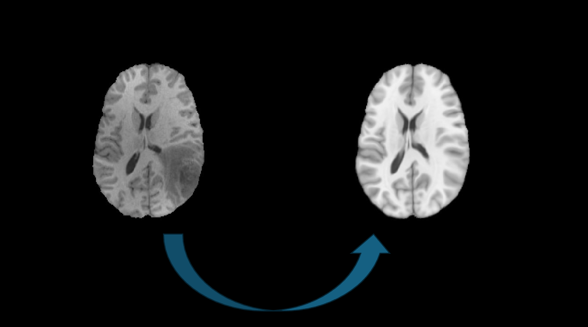

# brain-tumor-tissue-reconstruction
Reconstructing a **pre-tumor** brain state via atlas registration



## Tutorial - Registration through terminal 
 1. Clone the github directory
 2. Install the requirements.txt (ideally in a venv)
 3. Execute the main.py script to register the atlas on to the scan. 
 ```
 python main.py /path/to/scan /path/to/output
 ``` 
 You must provide the **path to the 3D MRI Scan** to be reconstructed and the path to the **folder where output should be stored**. 

 4. (optional) Specify flags to add other modalities in the output
 5. For transforming DTI images functions are needed, that are not yet supported in antspyx. The script currently used functions from ANTs. To use this functionality [ANTs](https://github.com/ANTsX/ANTs/wiki/Compiling-ANTs-on-Linux-and-Mac-OS) has to be installed on the machine.  

**Help Message** of main.py:

```
usage: main.py [-h] [-d] [-t] [-v] patient output

positional arguments:
  patient           Path to the MRI patient scan with a tumor. 
                    In nifti file format and registered into SRI space
  output            Output Folder to which the results will be saved

options:
  -h, --help           show this help message and exit
  -d, --transform_DTI  Additionally transform DTI Atlas fiber tractation in to the patients anatomy
  -t, --transform_TS   Additionally transform Atlas tissue segementation and probability maps for WM, GM, CSF in to the patients anatomy
  -v, --verbose        Verbose ...
```
For registering in python refer to the tutorial notebook